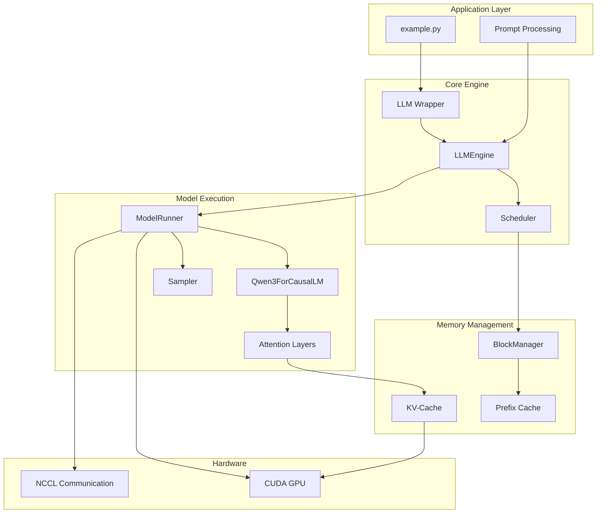
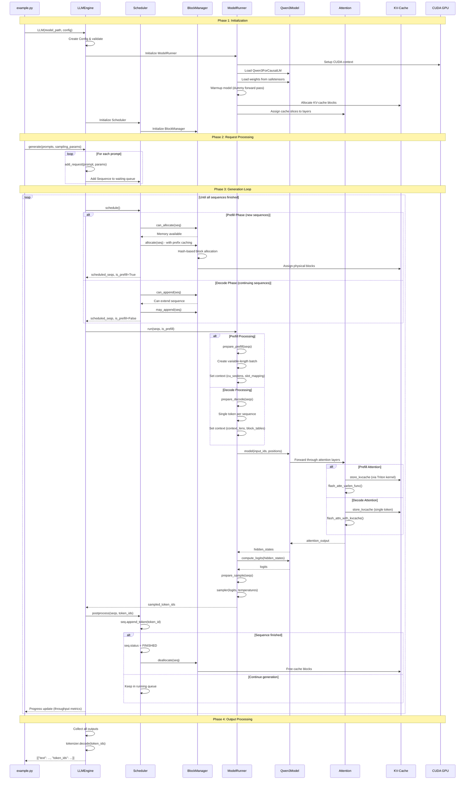
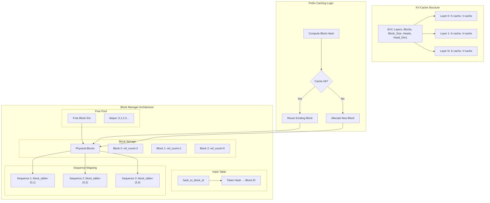
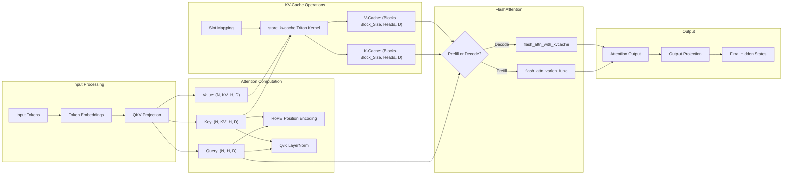
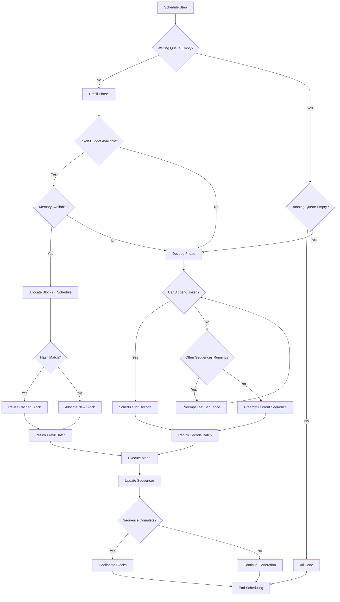

## Execution Flow Diagram

### High-Level System Architecture

```mermaid
graph TB
    subgraph "Application Layer"
        APP[example.py]
        PROMPTS[Prompt Processing]
    end
    
    subgraph "Core Engine"
        LLM[LLM Wrapper]
        ENGINE[LLMEngine]
        SCHED[Scheduler]
    end
    
    subgraph "Model Execution"
        RUNNER[ModelRunner]
        MODEL[Qwen3ForCausalLM]
        ATTN[Attention Layers]
        SAMPLER[Sampler]
    end
    
    subgraph "Memory Management"
        BLOCK[BlockManager]
        CACHE[KV-Cache]
        PREFIX[Prefix Cache]
    end
    
    subgraph "Hardware"
        GPU[CUDA GPU]
        NCCL[NCCL Communication]
    end
    
    APP --> LLM
    LLM --> ENGINE
    ENGINE --> SCHED
    ENGINE --> RUNNER
    SCHED --> BLOCK
    RUNNER --> MODEL
    MODEL --> ATTN
    ATTN --> CACHE
    RUNNER --> SAMPLER
    BLOCK --> PREFIX
    RUNNER --> GPU
    RUNNER --> NCCL
    
    PROMPTS --> ENGINE
    CACHE --> GPU
```

### Detailed Execution Flow

```mermaid
sequenceDiagram
    participant App as example.py
    participant Engine as LLMEngine
    participant Sched as Scheduler
    participant Block as BlockManager
    participant Runner as ModelRunner
    participant Model as Qwen3Model
    participant Attn as Attention
    participant Cache as KV-Cache
    participant GPU as CUDA GPU
    
    Note over App,GPU: Phase 1: Initialization
    App->>Engine: LLM(model_path, config)
    Engine->>Engine: Create Config & validate
    Engine->>Runner: Initialize ModelRunner
    Runner->>GPU: Setup CUDA context
    Runner->>Model: Load Qwen3ForCausalLM
    Runner->>Model: Load weights from safetensors
    Runner->>Runner: Warmup model (dummy forward pass)
    Runner->>Cache: Allocate KV-cache blocks
    Runner->>Attn: Assign cache slices to layers
    Engine->>Sched: Initialize Scheduler
    Sched->>Block: Initialize BlockManager
    
    Note over App,GPU: Phase 2: Request Processing
    App->>Engine: generate(prompts, sampling_params)
    loop For each prompt
        Engine->>Engine: add_request(prompt, params)
        Engine->>Sched: Add Sequence to waiting queue
    end
    
    Note over App,GPU: Phase 3: Generation Loop
    loop Until all sequences finished
        Engine->>Sched: schedule()
        
        alt Prefill Phase (new sequences)
            Sched->>Block: can_allocate(seq)
            Block-->>Sched: Memory available
            Sched->>Block: allocate(seq) - with prefix caching
            Block->>Block: Hash-based block allocation
            Block->>Cache: Assign physical blocks
            Sched-->>Engine: scheduled_seqs, is_prefill=True
        else Decode Phase (continuing sequences)  
            Sched->>Block: can_append(seq)
            Block-->>Sched: Can extend sequence
            Sched->>Block: may_append(seq)
            Sched-->>Engine: scheduled_seqs, is_prefill=False
        end
        
        Engine->>Runner: run(seqs, is_prefill)
        
        alt Prefill Processing
            Runner->>Runner: prepare_prefill(seqs)
            Runner->>Runner: Create variable-length batch
            Runner->>Runner: Set context (cu_seqlens, slot_mapping)
        else Decode Processing
            Runner->>Runner: prepare_decode(seqs)  
            Runner->>Runner: Single token per sequence
            Runner->>Runner: Set context (context_lens, block_tables)
        end
        
        Runner->>Model: model(input_ids, positions)
        Model->>Attn: Forward through attention layers
        
        alt Prefill Attention
            Attn->>Cache: store_kvcache (via Triton kernel)
            Attn->>Attn: flash_attn_varlen_func()
        else Decode Attention
            Attn->>Cache: store_kvcache (single token)
            Attn->>Attn: flash_attn_with_kvcache()
        end
        
        Attn-->>Model: attention_output
        Model-->>Runner: hidden_states
        Runner->>Model: compute_logits(hidden_states)
        Model-->>Runner: logits
        Runner->>Runner: prepare_sample(seqs)
        Runner->>Runner: sampler(logits, temperatures)
        Runner-->>Engine: sampled_token_ids
        
        Engine->>Sched: postprocess(seqs, token_ids)
        Sched->>Sched: seq.append_token(token_id)
        
        alt Sequence finished
            Sched->>Sched: seq.status = FINISHED
            Sched->>Block: deallocate(seq)
            Block->>Cache: Free cache blocks
        else Continue generation
            Sched->>Sched: Keep in running queue
        end
        
        Engine-->>App: Progress update (throughput metrics)
    end
    
    Note over App,GPU: Phase 4: Output Processing
    Engine->>Engine: Collect all outputs
    Engine->>Engine: tokenizer.decode(token_ids)
    Engine-->>App: [{"text": ..., "token_ids": ...}]
```

### Memory Management Detail

```mermaid
graph TB
    subgraph "Block Manager Architecture"
        subgraph "Free Pool"
            FREE[Free Block IDs]
            DEQUE["deque: 0,1,2,3..."]
        end
        
        subgraph "Hash Table"
            HASH[hash_to_block_id]
            LOOKUP[Token Hash → Block ID]
        end
        
        subgraph "Block Storage"
            BLOCKS[Physical Blocks]
            BLOCK0[Block 0: ref_count=2]
            BLOCK1[Block 1: ref_count=1] 
            BLOCK2[Block 2: ref_count=0]
        end
        
        subgraph "Sequence Mapping"
            SEQ1["Sequence 1: block_table=(0,1)"]
            SEQ2["Sequence 2: block_table=(0,2)"]
            SEQ3["Sequence 3: block_table=(3,4)"]
        end
    end
    
    subgraph "KV-Cache Structure"
        CACHE_DIM["(K/V, Layers, Blocks, Block_Size, Heads, Head_Dim)"]
        LAYER0[Layer 0: K-cache, V-cache]
        LAYER1[Layer 1: K-cache, V-cache]
        LAYERN[Layer N: K-cache, V-cache]
    end
    
    subgraph "Prefix Caching Logic"
        HASH_COMP[Compute Block Hash]
        CACHE_HIT{Cache Hit?}
        REUSE[Reuse Existing Block]
        ALLOCATE[Allocate New Block]
    end
    
    FREE --> BLOCKS
    HASH --> LOOKUP
    BLOCKS --> SEQ1
    BLOCKS --> SEQ2
    BLOCKS --> SEQ3
    
    CACHE_DIM --> LAYER0
    CACHE_DIM --> LAYER1
    CACHE_DIM --> LAYERN
    
    HASH_COMP --> CACHE_HIT
    CACHE_HIT -->|Yes| REUSE
    CACHE_HIT -->|No| ALLOCATE
    REUSE --> BLOCKS
    ALLOCATE --> BLOCKS
```

### Attention Computation Flow

```mermaid
graph LR
    subgraph "Input Processing"
        INPUT[Input Tokens]
        EMBED[Token Embeddings]
        QKV[QKV Projection]
    end
    
    subgraph "Attention Computation"
        Q["Query: (N, H, D)"]
        K["Key: (N, KV_H, D)"]
        V["Value: (N, KV_H, D)"]
        ROPE[RoPE Position Encoding]
        NORM[Q/K LayerNorm]
    end
    
    subgraph "KV-Cache Operations"
        SLOT[Slot Mapping]
        STORE[store_kvcache Triton Kernel]
        KCACHE["K-Cache: (Blocks, Block_Size, Heads, D)"]
        VCACHE["V-Cache: (Blocks, Block_Size, Heads, D)"]
    end
    
    subgraph "FlashAttention"
        FLASH_PREFILL[flash_attn_varlen_func]
        FLASH_DECODE[flash_attn_with_kvcache]
        CONTEXT{Prefill or Decode?}
    end
    
    subgraph "Output"
        ATTN_OUT[Attention Output]
        O_PROJ[Output Projection]
        FINAL[Final Hidden States]
    end
    
    INPUT --> EMBED
    EMBED --> QKV
    QKV --> Q
    QKV --> K
    QKV --> V
    Q --> ROPE
    K --> ROPE
    Q --> NORM
    K --> NORM
    
    K --> STORE
    V --> STORE
    SLOT --> STORE
    STORE --> KCACHE
    STORE --> VCACHE
    
    Q --> CONTEXT
    KCACHE --> CONTEXT
    VCACHE --> CONTEXT
    CONTEXT -->|Prefill| FLASH_PREFILL
    CONTEXT -->|Decode| FLASH_DECODE
    
    FLASH_PREFILL --> ATTN_OUT
    FLASH_DECODE --> ATTN_OUT
    ATTN_OUT --> O_PROJ
    O_PROJ --> FINAL
```

### Scheduling Decision Tree

```mermaid
graph TD
    START[Schedule Step] --> CHECK_WAITING{Waiting Queue Empty?}
    
    CHECK_WAITING -->|No| PREFILL_PHASE[Prefill Phase]
    CHECK_WAITING -->|Yes| CHECK_RUNNING{Running Queue Empty?}
    
    PREFILL_PHASE --> CHECK_TOKENS{Token Budget Available?}
    CHECK_TOKENS -->|Yes| CHECK_MEMORY{Memory Available?}
    CHECK_TOKENS -->|No| DECODE_PHASE[Decode Phase]
    
    CHECK_MEMORY -->|Yes| ALLOCATE[Allocate Blocks + Schedule]
    CHECK_MEMORY -->|No| DECODE_PHASE
    
    ALLOCATE --> HASH_CHECK{Hash Match?}
    HASH_CHECK -->|Yes| REUSE_BLOCK[Reuse Cached Block]
    HASH_CHECK -->|No| NEW_BLOCK[Allocate New Block]
    
    REUSE_BLOCK --> PREFILL_RETURN[Return Prefill Batch]
    NEW_BLOCK --> PREFILL_RETURN
    
    DECODE_PHASE --> CHECK_APPEND{Can Append Token?}
    CHECK_APPEND -->|Yes| SCHEDULE_DECODE[Schedule for Decode]
    CHECK_APPEND -->|No| PREEMPT{Other Sequences Running?}
    
    PREEMPT -->|Yes| PREEMPT_SEQ[Preempt Last Sequence]
    PREEMPT -->|No| PREEMPT_SELF[Preempt Current Sequence]
    
    PREEMPT_SEQ --> CHECK_APPEND
    PREEMPT_SELF --> DECODE_RETURN[Return Decode Batch]
    
    SCHEDULE_DECODE --> DECODE_RETURN
    
    CHECK_RUNNING -->|No| FINISHED[All Done]
    CHECK_RUNNING -->|Yes| DECODE_PHASE
    
    PREFILL_RETURN --> EXECUTE[Execute Model]
    DECODE_RETURN --> EXECUTE
    FINISHED --> END[End Scheduling]
    
    EXECUTE --> POSTPROCESS[Update Sequences]
    POSTPROCESS --> CHECK_COMPLETE{Sequence Complete?}
    CHECK_COMPLETE -->|Yes| DEALLOCATE[Deallocate Blocks]
    CHECK_COMPLETE -->|No| CONTINUE[Continue Generation]
    
    DEALLOCATE --> END
    CONTINUE --> END
```
